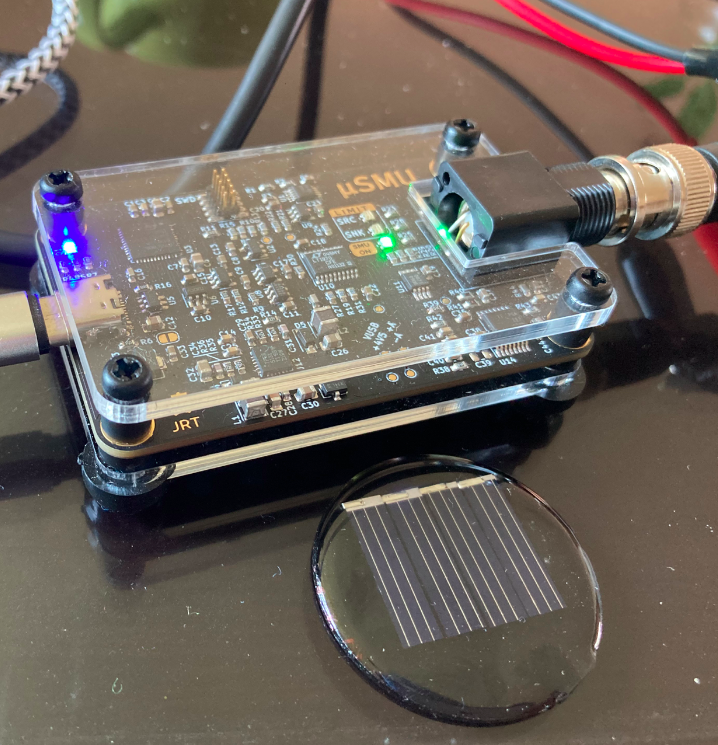
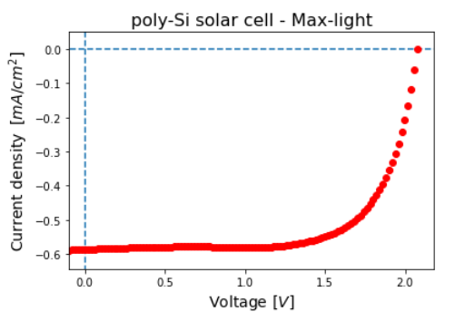

# pv_parameters

**Research Objective**

The current Jupyter Notebook extract the basic PV parameters from the J-V curve of [µSMU](https://github.com/joeltroughton/uSMU) device: Voc, Jsc, FF, Rs, Rp.

**Note:** The conversión efficiency is not calculated at this moment. If the insidence irradiance its know you can calculate using the following equation: Efficiency  = (Voc Jsc FF)/1000 W/m2

---

Fig.1  µSMU   device and a silicon (Si) solar cell

Fig.2 Curve JV from µSMU and plotted in JupyterNotebook 

##  Device parameters (Si mini Module)

The basic PV parameters were obteined with the following Jupyter Notebook: [light_jv_parameters.ipynb](/light_jv_parameters.ipynb) 

| Parameter     | Approximated  | statsmodels.api | 
| ------------- | ------------- | -------------   |
| Voc [V]       |  2.0999       | 2.0794          |
| Jsc [mA/cm2]  | -0.5867       | -0.5863         |
| FF            |  0.6888       | 0.696           |
| efficiency    |      -        |       -         |
|               |      -        |       -         |
| Rs [ohm cm2]  |      -        |       -         |
| Rp [ohm cm2]  |      -        |       -         |

---
### Donate

If this code helps you to extract the PV-parameters of JV curves. Please consider buying a cup of coffee to keep coding.

