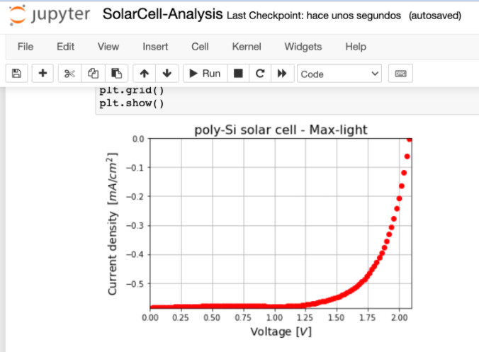

# pv_parameters

**Research Objective**

The current Jupyter Notebook extract the basic PV parameters from the J-V curve of µSMU device: Voc, Jsc, FF, Rs, Rp.

Note: The conversión efficiency is not calculated at this moment. If the insidence irradiance its know you can calculate using the following equation. 

$$\eta = \frac{V_{oc}J_{sc}FF}{1000 \:\text{W}/m^2}$$

---

Fig.1  µSMU   device and a silicon (Si) solar cell 

Fig.2 Curve JV from µSMU and plotted in JupyterNotebook and Python 3

---
### Donate

If this code helps you to extract the PV-parameters of JV curves. Please consider buying a cup of coffee to keep coding.

